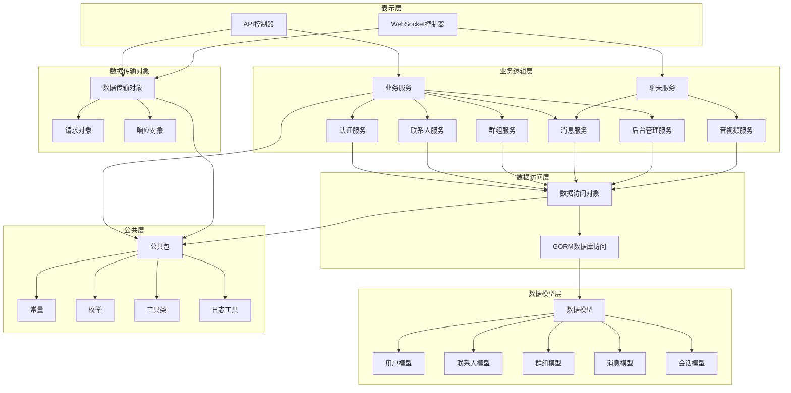
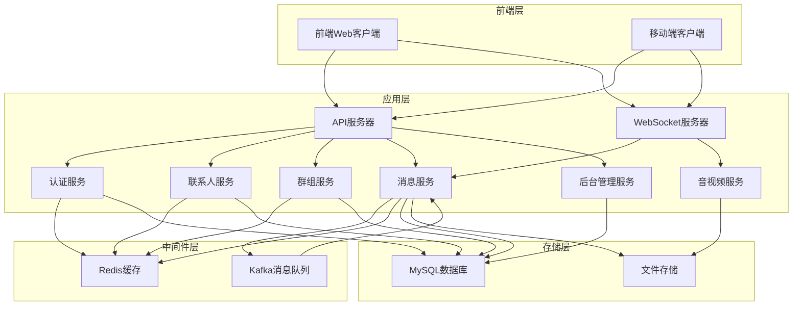
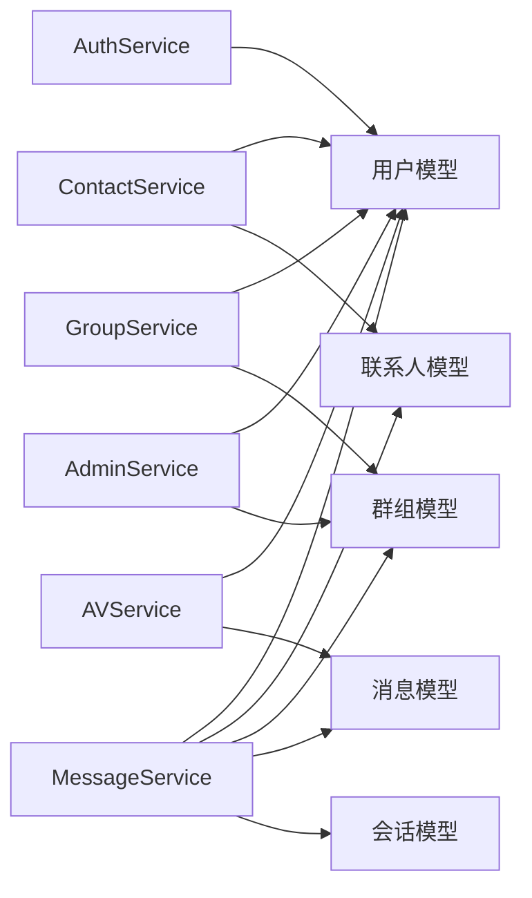
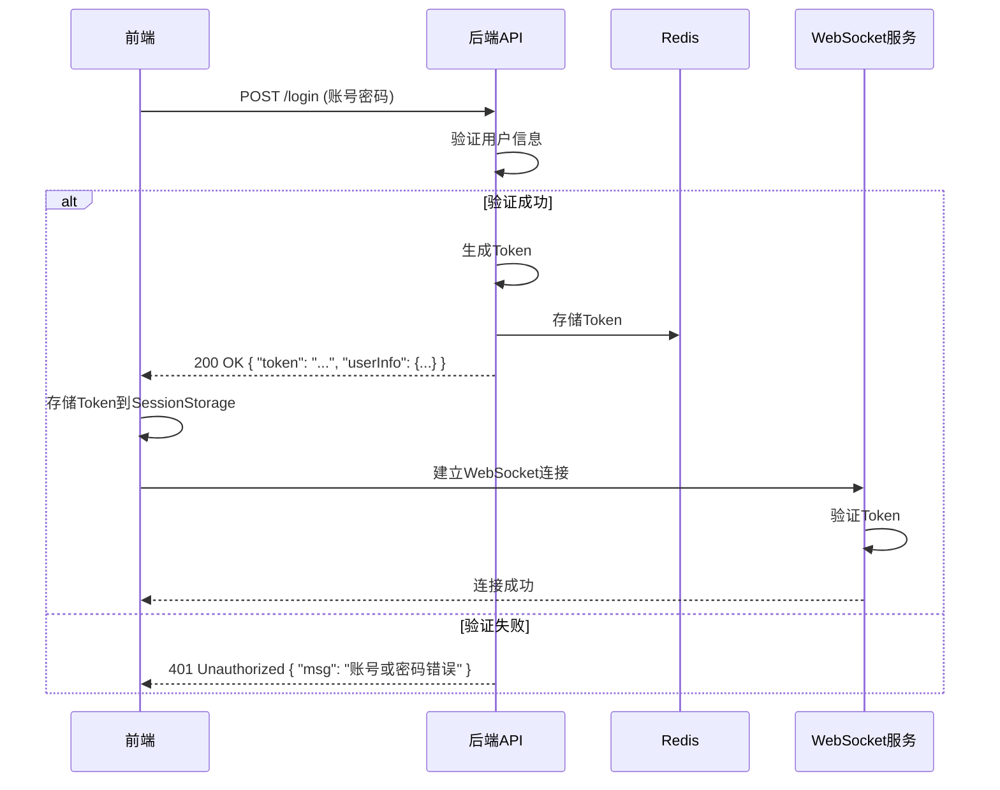
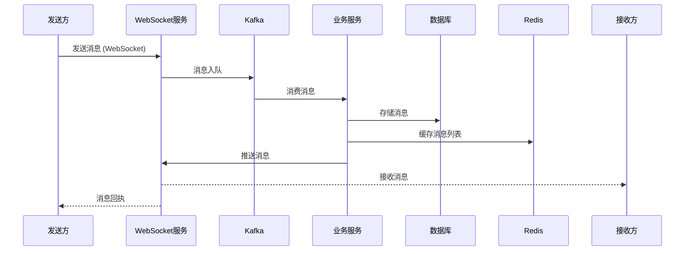
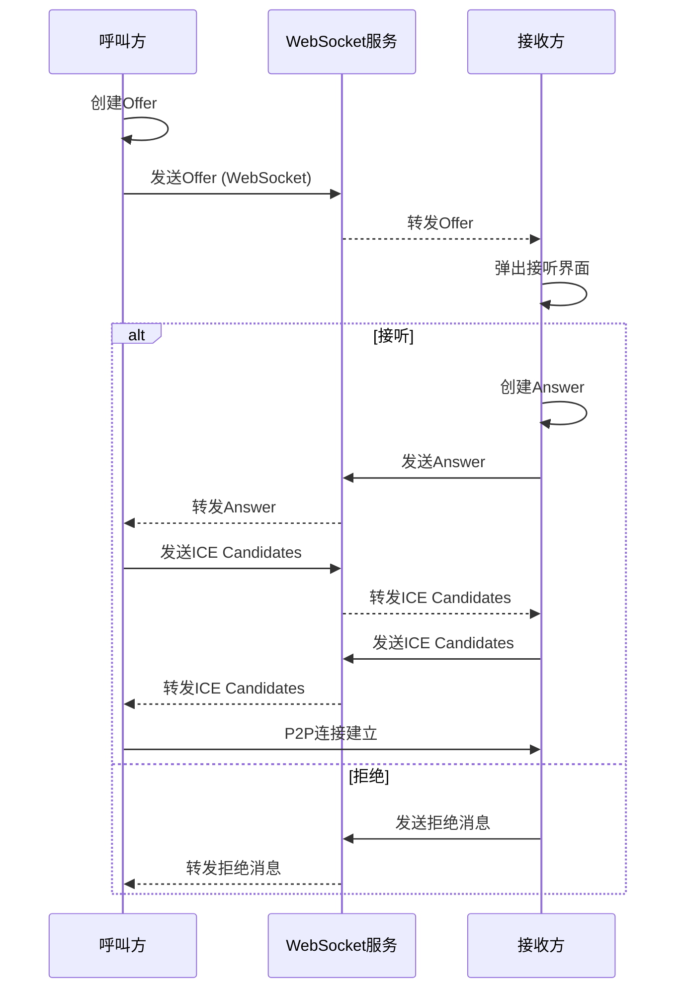

# WebsocketChat

一个基于WebSocket的实时聊天系统，支持文本消息、文件传输、音视频通话等功能。

## 🔧 快速开始

### 环境要求

- Go 1.20+ 
- MySQL 5.7+ 
- Redis 6.0+ 
- Kafka 2.8+ 
- Node.js 14+

### 安装步骤

1. **克隆项目**
    ```bash
    git clone <项目地址>
    cd WebsocketChat
    ```

2. **配置环境**
    - 修改 `configs/config.toml` 文件，配置数据库、Redis、Kafka等连接信息

3. **启动后端服务**
    ```bash
    # 编译
    go build -o server.exe ./cmd/Server/main.go
    # 运行
    ./server.exe
    ```

4. **启动前端服务**
    ```bash
    cd web/chat-server
    npm install
    npm run serve
    ```

5. **访问系统**
    - 前端：http://localhost:81
    - 后端API：http://localhost:8000

## 🎯 核心功能

### 1. 用户认证系统
- **账号密码登录**：通过手机号和密码进行登录验证
- **手机短信登录**：通过手机号和验证码进行登录
- **注册功能**：支持新用户注册，需要短信验证码验证
- **Token认证机制**：登录成功后生成Token，用于后续请求的身份验证

### 2. 联系人管理
- **添加/删除联系人**：支持添加新联系人，删除现有联系人
- **好友申请管理**：处理好友申请的发送、接受和拒绝
- **黑名单功能**：支持将用户加入黑名单，阻止其消息
- **联系人列表**：按字母分组显示联系人列表，支持搜索

### 3. 群组功能
- **创建群组**：支持创建新群组，设置群组名称和头像
- **解散群组**：群主可以解散群组
- **群成员管理**：添加/移除群成员，设置群管理员
- **群信息修改**：修改群组名称、头像等信息

### 4. 消息系统
- **文本消息**：支持发送和接收文本消息
- **文件传输**：支持上传和下载多种类型的文件
- **历史消息记录**：存储和查询历史消息
- **消息状态管理**：标记消息的发送状态（已发送、已读等）

### 5. 音视频通话
- **WebRTC实时通话**：基于WebRTC技术的音视频通话
- **通话状态管理**：管理通话的发起、接听、拒绝、挂断等状态
- **呼叫/接听/挂断功能**：支持发起呼叫，接听或拒绝呼叫，挂断通话

### 6. 后台管理
- **用户管理**：禁用/启用用户，设置管理员权限，删除用户
- **群组管理**：禁用/启用群组，删除群组

## 📁 代码分层

### 系统架构



### 代码分层说明

| 层级 | 目录 | 职责 | 文件示例 |
|------|------|------|----------|
| 表示层 | api/v1 | 处理HTTP请求和WebSocket连接 | user_info_controller.go, ws_controller.go |
| 业务逻辑层 | internal/service | 实现核心业务逻辑 | user_info_service.go, message_service.go |
| 数据访问层 | internal/dao | 与数据库交互 | gorm.go |
| 数据模型层 | internal/model | 定义数据库表结构 | user_info.go, message.go |
| 数据传输对象 | internal/dto | 定义请求和响应结构 | request/login_request.go, respond/login_respond.go |
| 公共层 | pkg | 提供公共功能 | constants/constants.go, zlog/logger.go |

## 🔌 接口设计

### 1. 用户认证接口

| 接口路径 | 方法 | 功能 | 请求参数 | 响应参数 |
|---------|------|------|----------|----------|
| /api/v1/register | POST | 用户注册 | `{"telephone": "13800138000", "password": "123456", "nickname": "测试用户", "smsCode": "123456"}` | `{"code": 0, "message": "注册成功", "data": {"uuid": "U12345678901", "telephone": "13800138000", "nickname": "测试用户"}}` |
| /api/v1/login | POST | 账号密码登录 | `{"telephone": "13800138000", "password": "123456"}` | `{"code": 0, "message": "登陆成功", "data": {"uuid": "U12345678901", "telephone": "13800138000", "nickname": "测试用户", "isAdmin": 0, "status": 1}}` |
| /api/v1/sms_login | POST | 短信验证码登录 | `{"telephone": "13800138000", "smsCode": "123456"}` | `{"code": 0, "message": "登陆成功", "data": {"uuid": "U12345678901", "telephone": "13800138000", "nickname": "测试用户"}}` |
| /api/v1/send_sms_code | POST | 发送短信验证码 | `{"telephone": "13800138000"}` | `{"code": 0, "message": "发送验证码成功", "data": null}` |
| /api/v1/update_user_info | POST | 更新用户信息 | `{"uuid": "U12345678901", "nickname": "新昵称", "avatar": "https://example.com/avatar.jpg"}` | `{"code": 0, "message": "修改用户信息成功", "data": null}` |

### 2. 联系人管理接口

| 接口路径 | 方法 | 功能 | 请求参数 | 响应参数 |
|---------|------|------|----------|----------|
| /api/v1/apply_contact | POST | 发送好友申请 | `{"user_id": "U12345678901", "contact_id": "U12345678902"}` | `{"code": 0, "message": "申请成功", "data": null}` |
| /api/v1/pass_contact_apply | POST | 接受好友申请 | `{"apply_id": "1", "user_id": "U12345678901", "contact_id": "U12345678902"}` | `{"code": 0, "message": "操作成功", "data": null}` |
| /api/v1/delete_contact | POST | 删除联系人 | `{"user_id": "U12345678901", "contact_id": "U12345678902"}` | `{"code": 0, "message": "删除成功", "data": null}` |
| /api/v1/get_contactinfo | POST | 获取联系人信息 | `{"user_id": "U12345678901", "contact_id": "U12345678902"}` | `{"code": 0, "message": "获取成功", "data": {"uuid": "U12345678902", "nickname": "联系人昵称", "avatar": "https://example.com/avatar.jpg"}}` |
| /api/v1/black_contact | POST | 加入黑名单 | `{"user_id": "U12345678901", "contact_id": "U12345678902"}` | `{"code": 0, "message": "操作成功", "data": null}` |

### 3. 群组管理接口

| 接口路径 | 方法 | 功能 | 请求参数 | 响应参数 |
|---------|------|------|----------|----------|
| /api/v1/create_group | POST | 创建群组 | `{"owner_id": "U12345678901", "group_name": "测试群组", "avatar": "https://example.com/group.jpg", "member_list": ["U12345678901", "U12345678902"]}` | `{"code": 0, "message": "创建成功", "data": {"uuid": "G12345678901", "group_name": "测试群组"}}` |
| /api/v1/update_groupinfo | POST | 更新群组信息 | `{"group_id": "G12345678901", "group_name": "新群组名称", "avatar": "https://example.com/new_group.jpg"}` | `{"code": 0, "message": "修改成功", "data": null}` |
| /api/v1/add_group_list | POST | 添加群成员 | `{"group_id": "G12345678901", "member_list": ["U12345678903", "U12345678904"]}` | `{"code": 0, "message": "添加成功", "data": null}` |
| /api/v1/remove_groupmembers | POST | 移除群成员 | `{"group_id": "G12345678901", "member_list": ["U12345678902"]}` | `{"code": 0, "message": "移除成功", "data": null}` |
| /api/v1/dissmiss_group | POST | 解散群组 | `{"group_id": "G12345678901", "owner_id": "U12345678901"}` | `{"code": 0, "message": "解散成功", "data": null}` |

### 4. 消息接口

| 接口路径 | 方法 | 功能 | 请求参数 | 响应参数 |
|---------|------|------|----------|----------|
| /api/v1/get_message_list | POST | 获取历史消息 | `{"session_id": "S12345678901", "page": 1, "page_size": 20}` | `{"code": 0, "message": "获取成功", "data": [{"uuid": "M12345678901", "content": "Hello", "send_id": "U12345678901", "created_at": "2024-01-01 12:00:00"}]}` |
| /api/v1/get_group_message_list | POST | 获取群聊历史消息 | `{"group_id": "G12345678901", "page": 1, "page_size": 20}` | `{"code": 0, "message": "获取成功", "data": [{"uuid": "M12345678901", "content": "Hello everyone", "send_id": "U12345678901", "created_at": "2024-01-01 12:00:00"}]}` |

### 5. WebSocket接口

| 接口路径 | 方法 | 功能 | 请求参数 | 响应参数 |
|---------|------|------|----------|----------|
| /ws | GET | 建立WebSocket连接 | `token=eyJhbGciOiJIUzI1NiIsInR5cCI6IkpXVCJ9...` | WebSocket连接 |

## 🚀 核心功能实现

### 1. 用户认证系统实现

**核心代码**：`internal/service/gorm/user_info_service.go`

- **登录流程**：
  1. 验证用户输入（手机号、密码）
  2. 查询数据库验证用户存在性
  3. 验证密码正确性
  4. 返回用户信息和登录状态

- **注册流程**：
  1. 验证短信验证码
  2. 检查手机号是否已注册
  3. 创建新用户记录
  4. 返回注册结果

- **短信验证码登录**：
  1. 验证手机号和验证码
  2. 查询用户信息
  3. 返回登录结果

### 2. 消息系统实现

**核心代码**：`internal/service/gorm/message_service.go` 和 `internal/service/chat/server.go`

- **消息发送流程**：
  1. 客户端通过WebSocket发送消息
  2. 服务器接收消息并解析
  3. 将消息发送到Kafka消息队列
  4. 消费端处理消息并存储到数据库
  5. 缓存消息列表到Redis
  6. 通过WebSocket推送消息给接收方
  7. 发送消息回执给发送方

- **消息存储**：
  - 使用MySQL存储消息历史
  - 使用Redis缓存最近消息
  - 使用Kafka处理消息队列

### 3. 群组功能实现

**核心代码**：`internal/service/gorm/group_info_service.go`

- **群组创建**：
  1. 验证群主权限
  2. 创建群组记录
  3. 添加初始成员
  4. 返回群组信息

- **群成员管理**：
  1. 验证操作权限
  2. 添加/移除群成员
  3. 更新群组信息
  4. 通知群成员变更

### 4. 音视频通话实现

**核心代码**：`internal/service/chat/server.go`

- **通话流程**：
  1. 呼叫方创建WebRTC Offer
  2. 通过WebSocket发送Offer给服务器
  3. 服务器转发Offer给接收方
  4. 接收方创建Answer并发送给服务器
  5. 服务器转发Answer给呼叫方
  6. 双方交换ICE Candidates
  7. 建立P2P连接

### 5. 后台管理实现

**核心代码**：`internal/service/gorm/user_info_service.go` 和 `internal/service/gorm/group_info_service.go`

- **用户管理**：
  - 启用/禁用用户
  - 设置管理员权限
  - 删除用户

- **群组管理**：
  - 启用/禁用群组
  - 删除群组
  - 管理群信息

## 📊 技术栈

| 分类 | 技术 | 版本 | 用途 |
|------|------|------|------|
| 后端语言 | Go | 1.20+ | 服务端开发 |
| 前端框架 | Vue.js | 2.x | 前端开发 |
| 数据库 | MySQL | 5.7+ | 数据存储 |
| 缓存 | Redis | 6.0+ | 缓存热点数据 |
| 消息队列 | Kafka | 2.8+ | 消息处理 |
| WebSocket | gorilla/websocket | v1.5.0 | 实时通信 |
| ORM | GORM | v1.25.0 | 数据库操作 |
| 认证 | JWT | - | Token认证 |
| 音视频 | WebRTC | - | 实时音视频通话 |

## 📁 模块关系

### 系统架构图



### 模块依赖关系



## 🔄 核心业务流程

### 1. 登录流程



### 2. 消息发送流程



### 3. 音视频通话流程



## 📊 数据库设计

### 核心数据表

1. **用户表 (user_info)**
    - id: 主键
    - uuid: 用户唯一标识
    - username: 用户名
    - password: 密码（加密）
    - phone: 手机号
    - avatar: 头像URL
    - user_type: 用户类型（普通用户/管理员）
    - status: 状态

2. **联系人表 (user_contact)**
    - id: 主键
    - user_id: 用户ID
    - contact_id: 联系人ID
    - status: 状态
    - created_at: 创建时间

3. **好友申请表 (contact_apply)**
    - id: 主键
    - apply_id: 申请人ID
    - receive_id: 接收人ID
    - status: 状态（待处理/已同意/已拒绝）
    - created_at: 创建时间

4. **群组表 (group_info)**
    - id: 主键
    - uuid: 群组唯一标识
    - group_name: 群组名称
    - owner_id: 群主ID
    - members: 群成员列表（JSON）
    - avatar: 群头像
    - status: 状态

5. **会话表 (session)**
    - id: 主键
    - uuid: 会话唯一标识
    - user_id: 用户ID
    - type: 会话类型（单聊/群聊）
    - target_id: 目标ID（用户ID/群组ID）
    - last_message: 最后一条消息
    - last_time: 最后消息时间

6. **消息表 (message)**
    - id: 主键
    - uuid: 消息唯一标识
    - session_id: 会话ID
    - type: 消息类型（文本/文件/音视频）
    - content: 消息内容
    - url: 文件URL
    - send_id: 发送人ID
    - receive_id: 接收人ID
    - status: 消息状态
    - created_at: 创建时间

## 🚀 性能优化

1. **消息队列**：使用Kafka进行消息削峰填谷，提高系统吞吐量
2. **缓存策略**：使用Redis缓存热点数据，如消息列表、用户信息等
3. **WebSocket连接池**：管理WebSocket连接，提高连接复用率
4. **数据库索引**：为常用查询字段添加索引，提高查询性能
5. **异步处理**：文件上传、消息存储等操作异步处理，提高响应速度

## 🔒 安全措施

1. **Token认证**：基于JWT的Token认证机制
2. **密码加密**：密码使用bcrypt加密存储
3. **API权限控制**：基于用户角色的权限控制
4. **WebSocket认证**：WebSocket连接需要Token验证
5. **跨域处理**：配置CORS，限制允许的来源

## 📈 监控与日志

1. **系统日志**：使用zlog库记录系统运行日志
2. **错误监控**：捕获并记录系统错误
3. **性能监控**：监控系统响应时间、吞吐量等指标
4. **Kafka监控**：监控消息队列状态

## 🎨 前端界面

### 主要页面
- 登录/注册页
- 联系人列表页
- 聊天界面
- 群组管理页
- 个人中心页
- 后台管理页

### 响应式设计
- 支持PC端和移动端
- 自适应不同屏幕尺寸

## 🔮 未来规划

1. **多端适配**：开发移动端APP（React Native/Flutter）
2. **消息加密**：实现端到端加密
3. **云存储**：集成云存储服务，提高文件存储可靠性
4. **集群部署**：支持多服务器集群部署
5. **AI功能**：集成AI助手，提供智能回复等功能