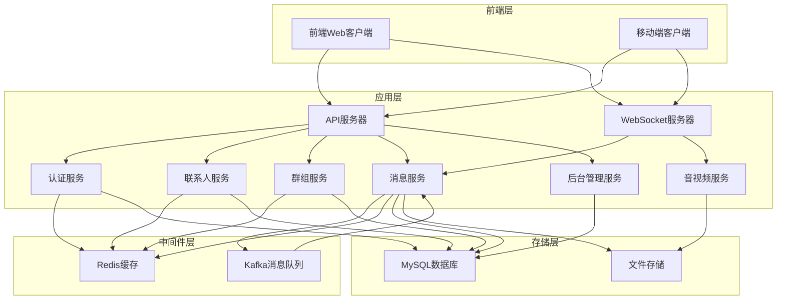
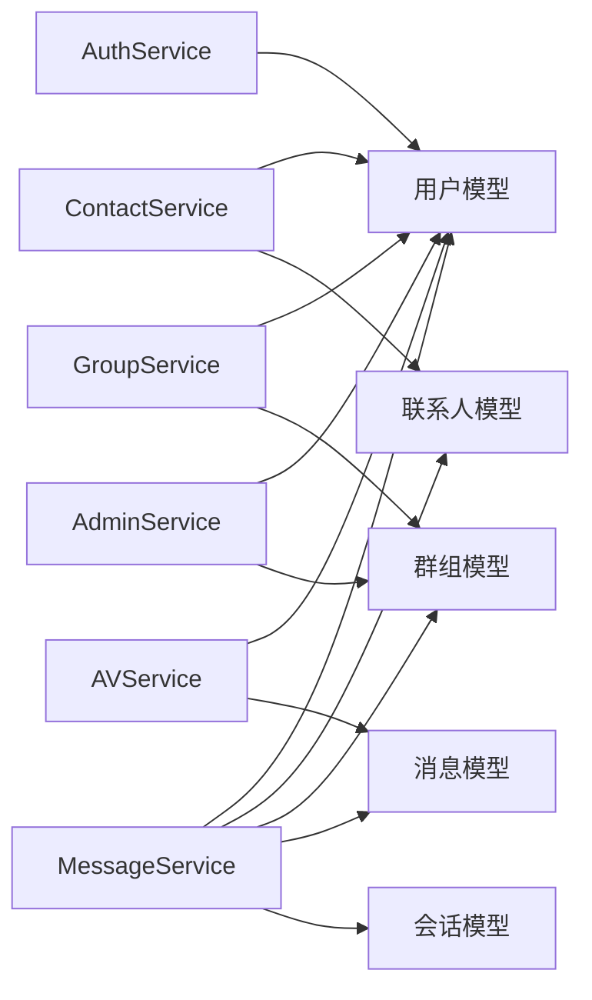
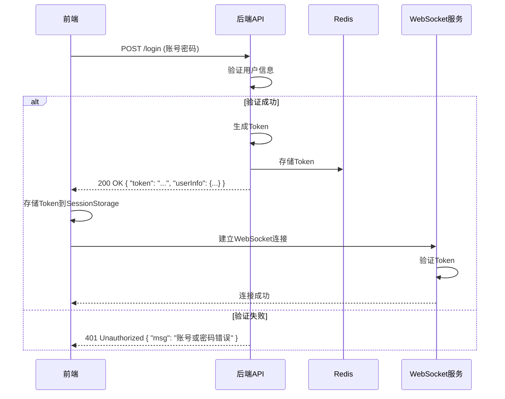
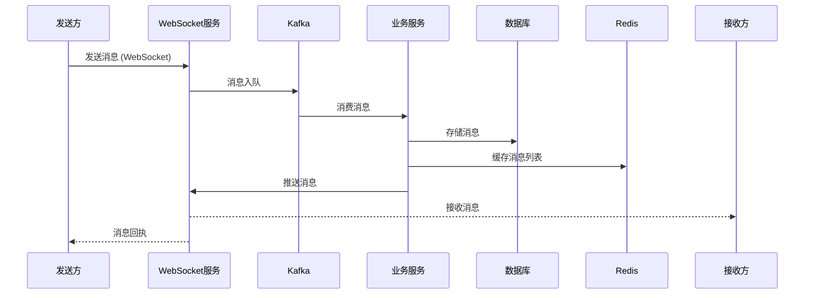
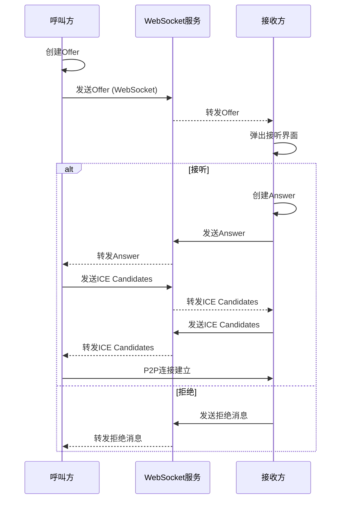

# WebsocketChat

一个基于WebSocket的实时聊天系统，支持文本消息、文件传输、音视频通话等功能。

## 🔧 快速开始

### 环境要求

- Go 1.20+ 
- MySQL 5.7+ 
- Redis 6.0+ 
- Kafka 2.8+ 
- Node.js 14+

### 安装步骤

1. **克隆项目**
    ```bash
    git clone <项目地址>
    cd WebsocketChat
    ```

2. **配置环境**
    - 修改 `configs/config.toml` 文件，配置数据库、Redis、Kafka等连接信息

3. **启动后端服务**
    ```bash
    # 编译
    go build -o server.exe ./cmd/Server/main.go
    # 运行
    ./server.exe
    ```

4. **启动前端服务**
    ```bash
    cd web/chat-server
    npm install
    npm run serve
    ```

5. **访问系统**
    - 前端：http://localhost:8080
    - 后端API：http://localhost:8000

## 🎯 核心功能

### 1. 用户认证系统
- 账号密码登录
- 手机短信登录
- 注册功能
- Token认证机制

### 2. 联系人管理
- 添加/删除联系人
- 好友申请管理
- 黑名单功能
- 联系人列表（按字母分组）

### 3. 群组功能
- 创建群组
- 解散群组
- 群成员管理（添加/移除）
- 群信息修改

### 4. 消息系统
- 文本消息
- 文件传输（支持多种文件类型）
- 历史消息记录
- 消息状态管理

### 5. 音视频通话
- WebRTC实时通话
- 通话状态管理
- 呼叫/接听/挂断功能

### 6. 后台管理
- 用户管理（禁用/启用/设置管理员）
- 群组管理（禁用/启用/删除）

## 📁 模块关系

### 系统架构图



### 模块依赖关系



## 🔄 核心业务流程

### 1. 登录流程



### 2. 消息发送流程



### 3. 音视频通话流程



## 📊 数据库设计

### 核心数据表

1. **用户表 (user_info)**
    - id: 主键
    - uuid: 用户唯一标识
    - username: 用户名
    - password: 密码（加密）
    - phone: 手机号
    - avatar: 头像URL
    - user_type: 用户类型（普通用户/管理员）
    - status: 状态

2. **联系人表 (user_contact)**
    - id: 主键
    - user_id: 用户ID
    - contact_id: 联系人ID
    - status: 状态
    - created_at: 创建时间

3. **好友申请表 (contact_apply)**
    - id: 主键
    - apply_id: 申请人ID
    - receive_id: 接收人ID
    - status: 状态（待处理/已同意/已拒绝）
    - created_at: 创建时间

4. **群组表 (group_info)**
    - id: 主键
    - uuid: 群组唯一标识
    - group_name: 群组名称
    - owner_id: 群主ID
    - members: 群成员列表（JSON）
    - avatar: 群头像
    - status: 状态

5. **会话表 (session)**
    - id: 主键
    - uuid: 会话唯一标识
    - user_id: 用户ID
    - type: 会话类型（单聊/群聊）
    - target_id: 目标ID（用户ID/群组ID）
    - last_message: 最后一条消息
    - last_time: 最后消息时间

6. **消息表 (message)**
    - id: 主键
    - uuid: 消息唯一标识
    - session_id: 会话ID
    - type: 消息类型（文本/文件/音视频）
    - content: 消息内容
    - url: 文件URL
    - send_id: 发送人ID
    - receive_id: 接收人ID
    - status: 消息状态
    - created_at: 创建时间

## 🚀 性能优化

1. **消息队列**：使用Kafka进行消息削峰填谷，提高系统吞吐量
2. **缓存策略**：使用Redis缓存热点数据，如消息列表、用户信息等
3. **WebSocket连接池**：管理WebSocket连接，提高连接复用率
4. **数据库索引**：为常用查询字段添加索引，提高查询性能
5. **异步处理**：文件上传、消息存储等操作异步处理，提高响应速度

## 🔒 安全措施

1. **Token认证**：基于JWT的Token认证机制
2. **密码加密**：密码使用bcrypt加密存储
3. **API权限控制**：基于用户角色的权限控制
4. **WebSocket认证**：WebSocket连接需要Token验证
5. **跨域处理**：配置CORS，限制允许的来源

## 📈 监控与日志

1. **系统日志**：使用zlog库记录系统运行日志
2. **错误监控**：捕获并记录系统错误
3. **性能监控**：监控系统响应时间、吞吐量等指标
4. **Kafka监控**：监控消息队列状态

## 🎨 前端界面

### 主要页面
- 登录/注册页
- 联系人列表页
- 聊天界面
- 群组管理页
- 个人中心页
- 后台管理页

### 响应式设计
- 支持PC端和移动端
- 自适应不同屏幕尺寸

## 🔮 未来规划

1. **多端适配**：开发移动端APP（React Native/Flutter）
2. **消息加密**：实现端到端加密
3. **云存储**：集成云存储服务，提高文件存储可靠性
4. **集群部署**：支持多服务器集群部署
5. **AI功能**：集成AI助手，提供智能回复等功能